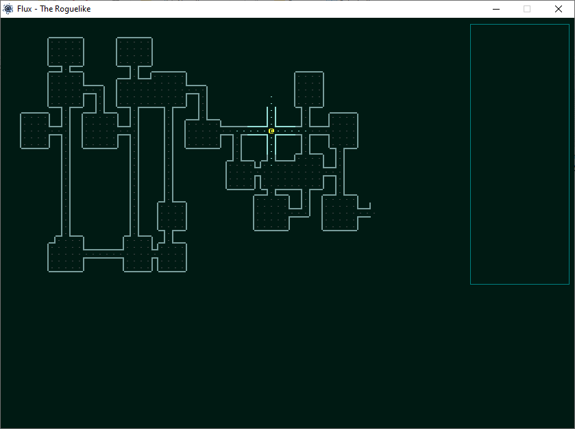
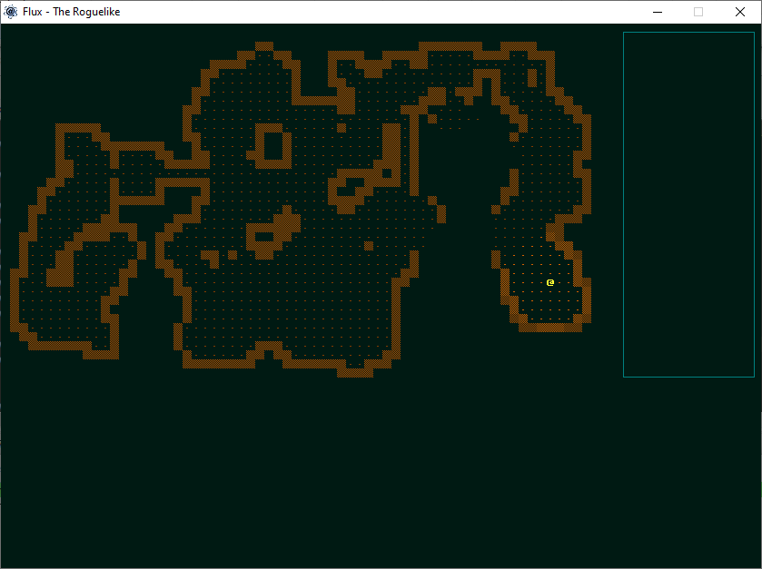

# FLUX (SDL Version)
**F**ree pasca**L** rog**U**elike e**X**ample

      

FLUX is a small hobby project to create a basic roguelike, it builds on the terminal version at https://github.com/cyberfilth/FLUX/ and includes the following basic features;

 - A randomly generated dungeon
 - Should run on GNU/Linux and Windows
 - Small, native binary under 1mb in size
 




The code is released into the public domain, feel free to use it or modify it in any way you choose.


## documentation
All code has been heavily commented so that you can generate documentation using PasDoc. Navigate to the source directory and create a folder called docs (or whatever you want to call it), then run the following commands.

```
mkdir docs/
pasdoc *.pas --output docs/
```
[](https://github.com/cyberfilth/Flux_SDL/stargazers)
